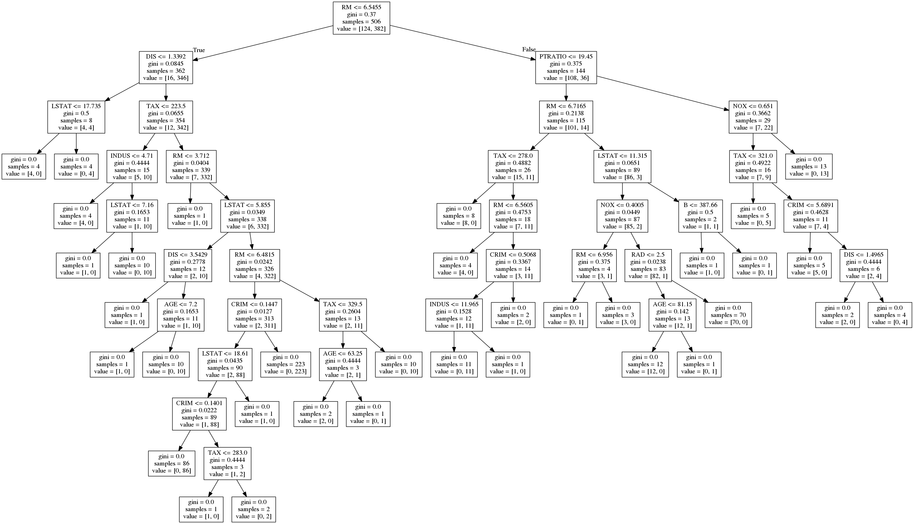

# DecisionTreeRules
This modules are made to get and modify the tree rules out of a decision tree from sklearn.
There are examples how to use in the file: example.py, simple_example.py  

In the simple example there is only a short introduction how to use the tree_extract_rule.py   
The simple_example uses iris dataset.  
The example.py uses the boston dataset with the following tree.  

## extract_rules
This methode is to extract the rules out of a decision tree. It is possible to calculate the precision and recall for other Dataset then the training dataset.
Return value: dictionary of rules with precision and recall in related to the used Dataset.

Structure of the dictionary:  
    {0:{'rule': If feature1 < 0.4 ..., 'targetclass': 'high' , 'class_dist': {'low': 0.0, 'high': 4.0}, 'precision': 0.9,'recall': 0.3},1: ....}

The methode needs the following parameters:  
    +param tree_given: decision Tree  
    +param features: please use 'features=dtrain.columns' directly before training the tree and use the list as features  
    +param dataset: dataset the decisionTree got (Data) (can be test or train data) (important: Type: Dataframe)  
    +param target_dataset: dataset the decisionTree got (Target) (can be test or train data)(important: Type: Dataframe)  
    +param show_test_dist: Only use if the dataset is the same dataset the tree is trained. If this is the case 'test_class_dist' should be the same as 'class_dist' in the dictionary.  
    +param regel: Name of class on which the rules point (only rules that point to special class). if None: all rules are printed  

example code:  
    
    irisdata = load_iris()
    
    
    iristree = tree.DecisionTreeClassifier()
    iristree = iristree.fit(irisdata.data, irisdata.target)
    
    #the data is not a panda Dataframe, thats why convert
    iris_data_pd = pd.DataFrame(irisdata.data)
    iris_target_pd = pd.Series(irisdata.target, name='target')
    
    #need featurenames:
    liste = iris_data_pd.columns
    
    #extract rules:
    rules=tree_extract_rule.extract_rules(iristree, liste, iris_data_pd, iris_target_pd)
    
    rules = pd.DataFrame.from_dict(rules)
    for i in rules.keys():
       print('Rule: '+str(i))
       print(rules[i])
       print('\n')

The module gives the following dictionary back:  
    {0: {'rule': 'If RM <= 6.54549980164\nIf DIS <= 1.33920001984\nIf LSTAT <= 17.7350006104\n', 'targetclass': 'high', 'class_dist': {'low': 0.0, 'high': 4.0}, 'precision': 1.0, 'recall': 0.03225806451612903}, 1: {'rule':....
    

And printed the rules:  
    {'rule': 'If RM <= 6.54549980164\n', 'targetclass': 'low', 'class_dist': {'low': 346.0, 'high': 16.0}, 'precision': 0.9558011049723757, 'recall': 0.9057591623036649}
    {'rule': 'If RM <= 6.54549980164\nIf DIS > 1.33920001984\n', 'targetclass': 'low', 'class_dist': {'low': 342.0, 'high': 12.0}, 'precision': 0.9661016949152542, 'recall': 0.8952879581151832}
    {'rule': 'If RM <= 6.54549980164\nIf DIS > 1.33920001984\nIf TAX > 223.5\n', 'targetclass': 'low', 'class_dist': {'low': 332.0, 'high': 7.0}, 'precision': 0.9793510324483776, 'recall': 0.8691099476439791}
    ....

## extract_elements_of_rulebelo
This methode is to extract certain elements of a dataset (format: pandas.DataFrame) belonging to a given rule.  
The methode returns a pandas.DataFrame with all data belonging to the rule.  

The methode needs the following parameters:  
    +param data: dataset to search in (panda)  
    +param rule: string, rule you want to use

example code: 
    elements = tree_extract_rule.extract_elements_of_rule(boston_data, 'If RM <= 6.54549980164\nIf DIS <= 1.33920001984\nIf LSTAT > 17.7350006104\n')
    print(elements)

result:
             CRIM   ZN  INDUS  CHAS    NOX     RM    AGE     DIS   RAD    TAX  \
    142   3.32105  0.0  19.58   1.0  0.871  5.403  100.0  1.3216   5.0  403.0   
    373  11.10810  0.0  18.10   0.0  0.668  4.906  100.0  1.1742  24.0  666.0   
    374  18.49820  0.0  18.10   0.0  0.668  4.138  100.0  1.1370  24.0  666.0   
    406  20.71620  0.0  18.10   0.0  0.659  4.138  100.0  1.1781  24.0  666.0   
    
         PTRATIO       B  LSTAT target  
    142     14.7  396.90  26.82    low  
    373     20.2  396.90  34.77    low  
    374     20.2  396.90  37.97    low  
    406     20.2  370.22  23.34    low 

## cut_tree_rules
This methode is to cut/modify the tree rules. There are three possibilities to cut/modify the tree. Please consider that the methode first filters for feature_strings, than precision and then recall values.  
    +cuting at a certain variable  
    +cuting at a certain precision  
    +cuting at a certain recall  

The methode returns the type of dictionary as the extract_rules methode.  

It needs the following paramters:  
    +param target_variabel_name: string of the target feature  
    +param cut_feature_str: feature name of the feature to cut.  
    +param data: dataset to search in (panda)  
    +param dict_of_rules_to_cut: list of strings, rule you want to use  
    +param max_precision: float value: if the precision is higher than this value the tree is cutted  
    +param min_recall: float value: if the recall is gets smaller than this value the tree is cutted before  
    
### Questions or annotations?
Please contact: gregor.schindler@student.kit.edu

